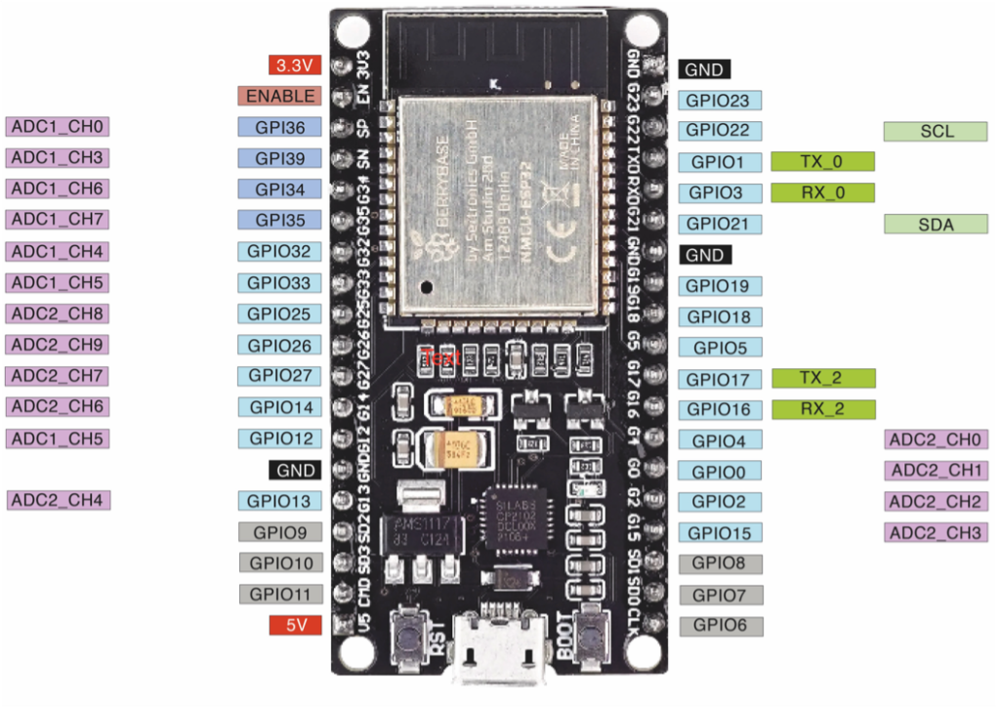

## ESP32 Gartenbahn RC-Receiver

Projekt basiert auf einem **ESP32 NodeMCU Dev Board** als Empfänger für Gartenbahn-RC-Steuerung.

---

## ESP32 Pinout Referenz: 
https://lastminuteengineers.com/esp32-pinout-reference/

## 🧩 ESP32 Dev Board Pinout

---

## ⚠️ GPIO-Pins – Belegung: 
|  Belegung      | Pin |------| Pin | Belegung        |
|----------------|-----|------|-----|-----------------|
| Leiste Außen   | 3V3 |      | GND | Leiste Innen   |
| -              | EN  |      | 23  | NRF24          |
| -              | 36  |      | 22  | NRF24          |
| -              | 39  |      | 1   | -              |
| -              | 34  |      | 3   | -              |
| -              | 35  |      | 21  | NRF24          |
| PWM 1          | 32  |      | GND | -              |
| PWM 2          | 33  |      | 19  | NRF24          |
| FRB            | 25  |      | 18  | NRF24          |
| FRA            | 26  |      | 5   | Horn           |
| FT             | 27  |      | 17  | RRB            |
| FLB            | 14  |      | 16  | RRA            |
| FLA            | 12  |      | 4   | RT             |
| -              | GND |      | 0   | RLB            |
| -              | 13  |      | 2   | RLA            |
| -              | 9   |      | 15  | INT            |
| -              | 10  |      | 8   | -              |
| -              | 11  |      | 7   | -              |
| Power IN       | 5V  |      | 6   | -              |

huhu

| Bezeichnung | GPIO | Sicher? | Grund | Zugewiesen |
|------|------|--------------|--------|--------|
| D0 | 0 | ⚠️ eingeschränkt | Must be **HIGH during boot**, **LOW for programming** |  | 
| TX0 | 1 | ❌ | TX pin, used for flashing and debugging |
| D2 | 2 | ⚠️ eingeschränkt | Must be **LOW during boot**, connected to on-board LED |
| RX0 | 3 | ❌ | RX pin, used for flashing and debugging |
| D4 | 4 | ✅ | — |
| D5 | 5 | ⚠️ eingeschränkt | Must be **HIGH during boot** |
| D6 | 6 | ❌ | Connected to Flash memory |
| D7 | 7 | ❌ | Connected to Flash memory |
| D8 | 8 | ❌ | Connected to Flash memory |
| D9 | 9 | ❌ | Connected to Flash memory |
| D10 | 10 | ❌ | Connected to Flash memory |
| D11 | 11 | ❌ | Connected to Flash memory |
| D12 | 12 | ⚠️ eingeschränkt | Must be **LOW during boot** |
| D13 | 13 | ✅ | — |
| D14 | 14 | ✅ | — |
| D15 | 15 | ⚠️ eingeschränkt | Must be **HIGH during boot**, LOW disables startup log |
| RX2 | 16 | ✅ | — |
| TX2 | 17 | ✅ | — |
| D18 | 18 | ✅ | — |
| D19 | 19 | ✅ | — |
| D21 | 21 | ✅ | — |
| D22 | 22 | ✅ | — |
| D23 | 23 | ✅ | — |
| D25 | 25 | ✅ | — |
| D26 | 26 | ✅ | — |
| D27 | 27 | ✅ | — |
| D32 | 32 | ✅ | — |
| D33 | 33 | ✅ | — |
| D34 | 34 | ❌ | Input-only GPIO |
| D35 | 35 | ❌ | Input-only GPIO |
| VP | 36 | ❌ | Input-only GPIO |
| VN | 39 | ❌ | Input-only GPIO |
