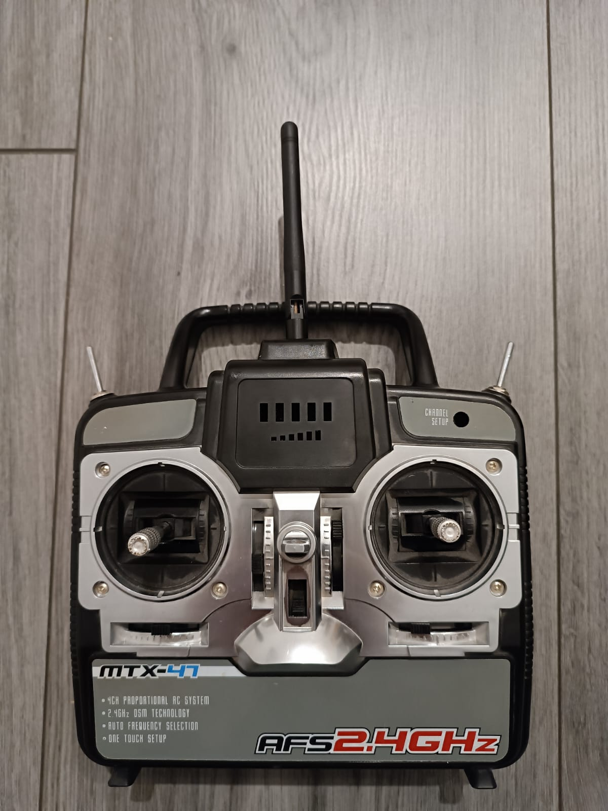

## ESP32 Gartenbahn RC-Receiver

Projekt basiert auf einem **ESP32 NodeMCU Dev Board** als Empfänger für Gartenbahn-RC-Steuerung.

---

## Features:

#### OTA-Updates: 
Lokale IP: 192.168.1.108

#### Preferences

Speicherung von Licht-Zuständen neustartübergreifen mit der  '***Preferences***' Lib

--- 

## Steuerung: 

### Belegung: 

#### Stick Links:
- X-Achse: < Vorwärst / > Rückwärts (nur wenn gestoppt) 
- Y-Achse: Fahrregler :arrow_up_down:

#### Stick Rechts: 

#### Schalter Links:
- Hupe 

#### Schalter Rechts:
- Schildkrötengang (runter = an)
- 
---

## ESP32 Pinout Referenz: 
https://lastminuteengineers.com/esp32-pinout-reference/

---

## GPIO-Pins – Belegung: 
|  Belegung      | Icon | Pin |------| Pin | Icon | Belegung        |
|----------------|------|-----|------|-----|------|-----------------|
| Leiste Außen   |  ➕  | 3V3 |      | GND | ➖  | Leiste Innen    |
| -              |      | EN  |      | 23  |  📡    | NRF24 MOSI      |
| -              |      | 36  |      | 22  |  📡    | NRF24 CE        |
| -              |      | 39  |      | 1   |      | -               |
| -              |      | 34  |      | 3   |      | -               |
| -              |      | 35  |      | 21  |  📡    | NRF24 CSN       |
| PWM 1          |  ⬆️ | 32  |      | GND |      | -              |
| PWM 2          |  ⬇️ | 33  |      | 19  |  📡    | NRF24 MISO     |
| Licht FRB      |  💡  | 25  |      | 18  |  📡    | NRF24 SCK      |
| Licht FRA      |  💡  | 26  |      | 5   |  💡  | Licht RRB      |
| Licht FT       |  💡  | 27  |      | 17  |  💡  | Licht RRA      |
| Licht FLB      |  💡  | 14  |      | 16  |  💡  | Licht RT       |
| Licht FLA      |  💡  | 12  |      | 4   |  💡  | Licht RLB      |
| -              |      | GND |      | 0   |  💡  | Licht RLA      |
| -              |      | 13  |      | 2   |  🔊  | Horn            |
| -              |      | 9   |      | 15  |  🕯️  | Licht innen     |
| -              |      | 10  |      | 8   |      | -               |
| -              |      | 11  |      | 7   |      | -               |
| Power IN       | ➡️  | 5V  |      | 6   |      | -               |

---

## GPIO-Pins – Tabelle: 
| Bezeichnung | GPIO | Sicher? | Grund                                                                 |
|-------------|------|---------|-----------------------------------------------------------------------|
| D0          | 0    | ⚠️     | Muss **HIGH beim Booten** sein, **LOW zum Programmieren**              |
| TX0         | 1    | ❌     | TX-Pin, wird zum Flashen und Debuggen verwendet                       |
| D2          | 2    | ⚠️     | Muss **LOW beim Booten** sein, verbunden mit der On-Board-LED          |
| RX0         | 3    | ❌     | RX-Pin, wird zum Flashen und Debuggen verwendet                       |
| D4          | 4    | ✅     | —                                                                     |
| D5          | 5    | ⚠️     | Muss **HIGH beim Booten** sein                                         |
| D6          | 6    | ❌     | Mit Flash-Speicher verbunden                                          |
| D7          | 7    | ❌     | Mit Flash-Speicher verbunden                                          |
| D8          | 8    | ❌     | Mit Flash-Speicher verbunden                                          |
| D9          | 9    | ❌     | Mit Flash-Speicher verbunden                                          |
| D10         | 10   | ❌     | Mit Flash-Speicher verbunden                                          |
| D11         | 11   | ❌     | Mit Flash-Speicher verbunden                                          |
| D12         | 12   | ⚠️     | Muss **LOW beim Booten** sein                                          |
| D13         | 13   | ✅     | —                                                                     |
| D14         | 14   | ✅     | —                                                                     |
| D15         | 15   | ⚠️     | Muss **HIGH beim Booten** sein, LOW deaktiviert das Start-Log          |
| RX2         | 16   | ✅     | —                                                                     |
| TX2         | 17   | ✅     | —                                                                     |
| D18         | 18   | ✅     | —                                                                     |
| D19         | 19   | ✅     | —                                                                     |
| D21         | 21   | ✅     | —                                                                     |
| D22         | 22   | ✅     | —                                                                     |
| D23         | 23   | ✅     | —                                                                     |
| D25         | 25   | ✅     | —                                                                     |
| D26         | 26   | ✅     | —                                                                     |
| D27         | 27   | ✅     | —                                                                     |
| D32         | 32   | ✅     | —                                                                     |
| D33         | 33   | ✅     | —                                                                     |
| D34         | 34   | ❌     | GPIO nur als Eingang nutzbar                                          |
| D35         | 35   | ❌     | GPIO nur als Eingang nutzbar                                          |
| VP          | 36   | ❌     | GPIO nur als Eingang nutzbar                                          |
| VN          | 39   | ❌     | GPIO nur als Eingang nutzbar                                          |

---

## ESP32 NodeMCU Pinout

